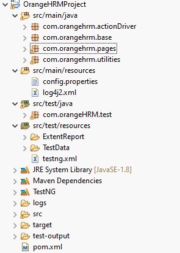
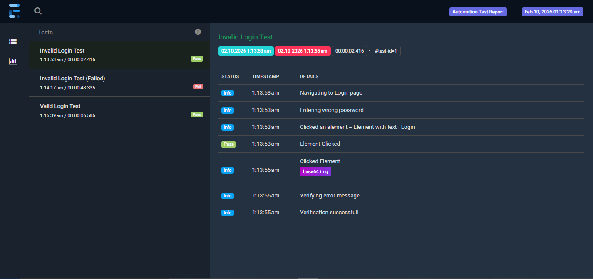
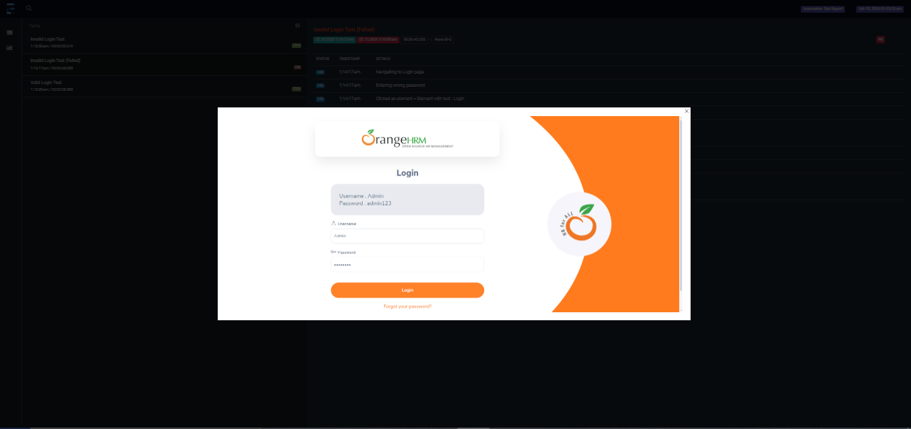

# 🚀 UI Automation Framework – OrangeHRM

This repository contains a **UI Automation Testing Framework** built using  
**Java, Selenium WebDriver, TestNG, and Extent Reports**.

The framework is designed to be **scalable, maintainable**, and supports  
**parallel execution** and **cross-browser testing**.

---

## 🔗 Application Under Test

🔗 https://opensource-demo.orangehrmlive.com/web/index.php/auth/login

---

## 🛠 Tech Stack

- **Language:** Java  
- **Automation Tool:** Selenium WebDriver  
- **Test Framework:** TestNG  
- **Build Tool:** Maven  
- **Reporting:** Extent Reports  
- **Test Data:** Apache POI (Excel)  
- **Logging:** Log4j  
- **Execution:** Parallel & Cross Browser Testing
- Implemented **Base64 encoding** for image generation and embedding screenshots directly into Extent Reports


---

## 🏗 Framework Architecture

This framework follows the **Page Object Model (POM)** design pattern.

### Key Highlights
- Reusable page classes  
- Centralized WebDriver management  
- Externalized configuration (`config.properties`)  
- Excel-based test data handling  
- Rich HTML reports with screenshots  

---

## 📁 Project Structure
src/main/java <br>
├── com.orangehrm.actionDriver<br>
├── com.orangehrm.base<br>
├── com.orangehrm.pages<br>
└── com.orangehrm.utilities<br>

src/main/resources<br>
├── config.properties<br>
└── log4j2.xml<br>

src/test/java<br>
└── com.orangehrm.test<br>

src/test/resources<br>
├── ExtentReport<br>
├── TestData<br>
└── testng.xm<br>


📌 **Project folder structure:**  


---

## ⚡ Parallel Execution & Cross Browser Testing

- Implemented using **TestNG**
- Supports execution on:
  - Chrome
  - Firefox
  - Edge
- Browser selection controlled via configuration
- Reduces overall execution time significantly

---

## 📊 Reporting – Extent Reports

The framework generates detailed **Extent HTML Reports** after execution.

### 📌 Overall Execution Report


### 📌 Pie Chart Report


### 📌 Failure Screenshot Report


---

## ▶️ How to Run Tests

1. Clone the repository  
2. Open the project in IntelliJ / Eclipse  
3. Update `config.properties` if needed  
4. Run tests using:

```bash
mvn test

## 🔮 Future Scope

- Integrate the automation framework with **CI/CD pipelines** using tools such as:
  - **GitHub Actions**
  - **Jenkins**
  - **GitLab CI**
- Enable automated test execution on:
  - Code commits
  - Pull requests
  - Scheduled (nightly) runs
- Automatically generate and publish **Extent Reports** as build artifacts
- Add **Docker** support for consistent and isolated test execution
- Integrate with **cloud-based browser platforms** like **Selenium Grid** or **BrowserStack**

---

## 🙌 Thanks for Reading

Thank you for taking the time to review this automation framework.  
Your feedback, suggestions, and contributions are always welcome.

⭐ If you find this project useful, consider giving it a star!


